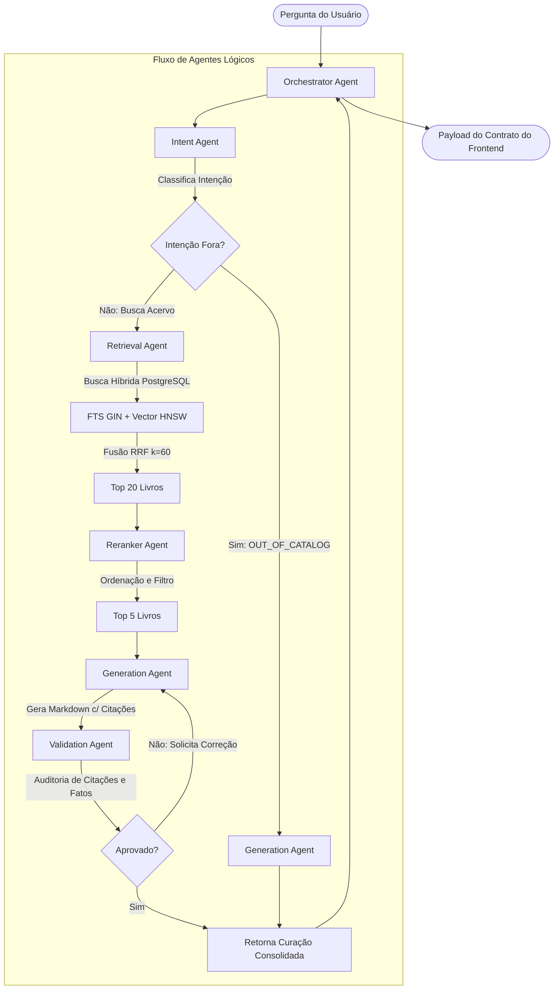

# Assistente de Curadoria do Catálogo (Backend & IA)

Este repositório contém a solução corporativa completa de backend, banco de dados e inteligência artificial para o **Assistente de Curadoria do Catálogo**, desenhado para apoiar os times internos de Comercial, Editorial, Marketing e Atendimento ao Cliente na recomendação e exploração do catálogo de publicações.

A solução foi projetada de forma profissional sob os princípios de **Clean Architecture**, **Domain Driven Design (DDD)**, orquestração multiagente lógica e busca híbrida avançada.

---

## 1. Visão Geral da Arquitetura

O sistema é dividido em três camadas desacopladas que se integram de forma assíncrona:

```
[ Frontend (Vite + React SPA) ]
            ↓ (POST /api/ask)
[ Backend (FastAPI Layer) ]
            ↓ (Orquestração de Agentes)
[ Camada de IA (Multi-Agent Engine) ] ──(OpenRouter API)──> [ GPT-4o-mini & Text-Embedding-3 ]
            ↓ (Hybrid Search: FTS + Vetorial)
[ Banco de Dados (PostgreSQL + pgvector) ]
```

### Decisões de Design & Padrões Adotados
1. **Desacoplamento do Provedor de IA**: Criou-se a abstração `BaseAIProvider` em `ai/providers/base_provider.py`. Toda a lógica dos agentes consome essa interface, permitindo trocar o provedor (ex: de OpenRouter para Google Vertex AI, AWS Bedrock ou modelos locais) sem alterar nenhuma regra de negócio.
2. **Busca Híbrida com Fusão RRF**: Em vez de depender apenas de busca semântica (vetores) ou busca sintática (palavras-chave), implementamos ambas em paralelo. Os resultados são unificados através de **Reciprocal Rank Fusion (RRF)** com $k=60$, garantindo relevância lexical e conceitual ao mesmo tempo.
3. **Validação Pós-Geração (Self-Correction)**: O `ValidationAgent` audita o texto final do `GenerationAgent`. Ele verifica de forma programática se as citações (como `[1]`, `[2]`) batem estritamente com os livros do banco e usa o LLM para auditar contradições do catálogo. Caso detecte uma falha, solicita a regeneração da resposta (com até 2 retentativas).

---

## 2. Fluxo Multiagente (Mermaid)

O processamento cognitivo de uma pergunta segue o grafo de execução abaixo:



---

## 3. Modelo de Dados & Índices

### Tabela `books`
*   `id`: Identificador principal (IDs `"1"` a `"20"`).
*   `title`, `authors`, `genres`, `target_audience`, `synopsis`: Metadados enriquecidos para o catálogo.
*   `price`, `pages`, `isbn`, `tags`, `marketing_hooks`, `cover_color`: Dados exigidos pelo layout do frontend.
*   `embedding`: Vetor de `1536` dimensões (Gerado via `text-embedding-3-small` sobre documento concatenado contendo todos os metadados do livro).
*   `fts_vector`: Coluna gerada em tempo de inserção que armazena a representação léxica em português dos campos textuais.

### Estrutura de Índices (DDL PostgreSQL)
*   **BTree**: Criado implicitamente na Primary Key `id` e explicitamente em `isbn` para buscas diretas.
*   **GIN (Generalized Inverted Index)**: Criado na coluna `fts_vector` para pesquisas de texto completo rápidas:
    ```sql
    CREATE INDEX books_fts_idx ON books USING GIN (fts_vector);
    ```
*   **HNSW (Hierarchical Navigable Small World)**: Criado na coluna de embeddings para busca aproximada de vizinhos mais próximos (ANN) com similaridade de cosseno:
    ```sql
    CREATE INDEX books_embedding_hnsw_idx ON books USING hnsw (embedding vector_cosine_ops);
    ```

---

## 4. Trade-offs Arquiteturais

### Busca Híbrida (FTS + Vetores) vs. Apenas Vetores
*   **Apenas Vetores**: Ótimo para buscas conceituais (ex: "livro sobre amor em Ouro Preto"), mas falha miseravelmente em buscas por termos exatos (ex: buscar pelo ISBN "978-85-1234-567-5" ou nome do autor "Tio Gustavo").
*   **Abordagem Híbrida**: A busca textual FTS entrega precisão cirúrgica em identificação de termos e ISBNs exatos, enquanto a busca vetorial brilha no entendimento semântico. A fusão **RRF** unifica os pontos fortes de ambos.

### Agentes Lógicos vs. Agentes Autônomos (LangGraph/CrewAI)
*   **Frameworks Pesados (CrewAI/LangGraph)**: Adicionam alta complexidade, latência de rede adicional em loops e acoplamento a padrões mutáveis de terceiros.
*   **Agentes Lógicos em Python Puro**: Implementados como classes Python assíncronas simples. Garantem **baixo acoplamento**, **latência mínima**, controle total do fluxo determinístico e facilidade extrema de depuração.

---

## 5. Estimativa de Custos (OpenRouter API)

Assumindo a utilização do modelo recomendado **GPT-4o-mini** para orquestração geral e geração:

*   **Embeddings** (`text-embedding-3-small`): ~\$0.00002 / 1k tokens.
    *   Custo de indexar 20 livros: menos de \$0.01 de dólar.
*   **Orquestração de Agentes (Por Pergunta)**:
    *   `IntentAgent`: ~250 tokens in / ~50 tokens out.
    *   `RerankerAgent`: ~2500 tokens in / ~100 tokens out.
    *   `GenerationAgent`: ~2500 tokens in / ~500 tokens out.
    *   `ValidationAgent`: ~3500 tokens in / ~50 tokens out.
    *   **Total por request**: ~9000 tokens de entrada / ~700 tokens de saída.
    *   Utilizando GPT-4o-mini (\$0.150/M tokens input e \$0.600/M tokens output):
        *   Custo de entrada por chamada: \$0.00135
        *   Custo de saída por chamada: \$0.00042
        *   **Custo total estimado por pergunta**: ~\$0.00177 (Menos de 1 centavo de real brasileiro por curadoria completa).

---

## 6. Limitações & Roadmap

### Limitações Atuais
1.  **Indexação Síncrona**: O script de ingestão gera embeddings em loop síncrono por livro. Para catálogos massivos (>10.000 livros), isso causaria gargalo de taxa limite de requisições (Rate Limits).
2.  **Volatilidade do OpenRouter**: Por ser um agregador de APIs, a latência do OpenRouter pode variar ligeiramente em picos de tráfego se comparado a uma integração de canal direto (ex: Google Cloud ou OpenAI Enterprise).

### Roadmap de Evolução
*   [ ] **Ingestão em Lotes (Batches) Assíncronos**: Implementar paralelização via `asyncio.gather` com limitador de taxa (semáforos) no script de embeddings.
*   [ ] **Cache Semântico (Semantic Caching)**: Armazenar curadorias comuns em Redis utilizando similaridade vetorial para retornar respostas repetidas em <50ms sem gastar tokens.
*   [ ] **Histórico de Conversas (Memória)**: Expandir o `AgentOrchestrator` para suportar memória de conversa e permitir refinamentos na mesma pauta de curadoria.

---

## 7. Como Executar o Projeto

### Pré-requisitos
*   **Docker** e **Docker Compose** instalados.
*   Uma chave de API do **OpenRouter** configurada no ambiente (opcional, o sistema roda com mockups resilientes locais caso a chave não esteja presente).

### Configurando o Ambiente
Crie um arquivo `.env` na raiz do projeto (copiando do `.env.example` da pasta do frontend):
```bash
OPENROUTER_API_KEY="sua_chave_aqui"
```

### Inicializando via Docker Compose (Recomendado)
Para subir o banco de dados (com extensão pgvector ativa), o backend FastAPI e o frontend Node Express:
```bash
docker-compose up --build
```
Acesse o assistente em seu navegador no endereço: **`http://localhost:3000`**

### Inicializando Manualmente (Desenvolvimento Local)
Se preferir rodar sem containers Docker:

1.  **Subir o banco PostgreSQL** e garantir a instalação da extensão `pgvector`.
2.  **Instalar dependências Python**:
    ```bash
    pip install -r requirements.txt
    ```
3.  **Executar o script de Ingestão de Livros & Geração de Embeddings**:
    ```bash
    python ai/ingest/ingest_books.py
    ```
4.  **Iniciar o Backend FastAPI**:
    ```bash
    uvicorn backend.app.main:app --reload --port 8000
    ```
5.  **Iniciar o Frontend Node**:
    ```bash
    cd frontend
    npm install
    npm run dev
    ```

---

## 8. Módulo de Avaliação (Auditoria Offline)

O módulo em `ai/evaluation` permite medir de forma científica a acurácia da curadoria RAG.

Para rodar os testes offline ( Recall@5, Precision@5 e LLM-as-Judge):
```bash
PYTHONPATH=. python3 ai/evaluation/evaluator.py
```
O script gerará um relatório detalhado em **`ai/evaluation/results.csv`**, incluindo justificativas de notas do Juiz LLM e latências de resposta, pronto para apresentação aos Tech Leads e Product Owners.

---

## 9. Uso de IA Assistiva (Declaração de Transparência)

Conforme as diretrizes da Seção 6 do edital, esta solução foi construída em parceria com a IA assistiva **Gemini (via Antigravity Engine)**.
*   **Papel da IA**: Auxílio no design e geração da arquitetura DDD/Clean Architecture de agentes Python, modelagem de tabelas SQLAlchemy + pgvector, algoritmos de fusão híbrida RRF, scripts de testes automatizados e roteamento de middlewares de correlação.
*   **Engenharia de Prompt**: O desenvolvimento foi conduzido de forma iterativa, onde o desenvolvedor revisou, testou e ajustou os prompts de sistema e as regras de re-ranqueamento/validação dos agentes lógicos.
